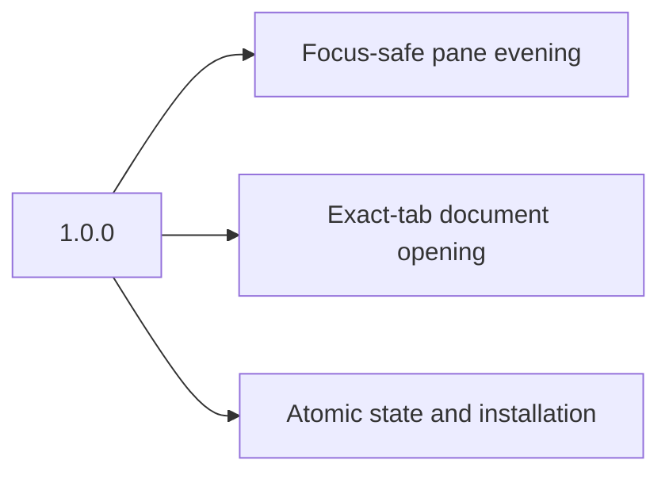

# Changelog

All notable changes are documented here. The format follows [Keep a Changelog](https://keepachangelog.com/en/1.1.0/), and versions follow [Semantic Versioning](https://semver.org/).

## [1.0.0] - 2026-08-31

### Added

- Event-driven automatic evening for the selected active iTerm2 tab.
- Focus-safe document opening in the exact calling tab, including background tabs.
- Atomic state writes and process-owned command locking.
- Self-contained Markdown rendering with pre-rendered Mermaid diagrams.
- Versioned installation, health checks, update rollback, and uninstall support.
- Python and Node regression suites, dependency audit, and continuous integration.
