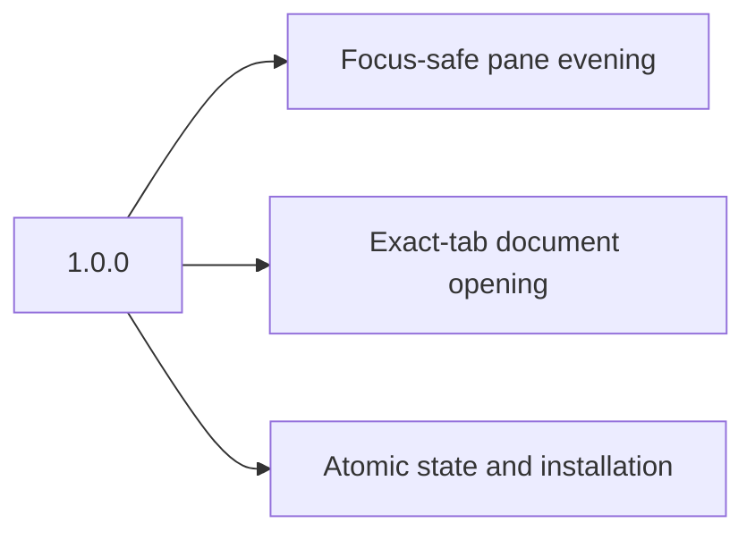

# Changelog

All notable changes are documented here. The format follows [Keep a Changelog](https://keepachangelog.com/en/1.1.0/), and versions follow [Semantic Versioning](https://semver.org/).

## [Unreleased]

### Fixed

- Mermaid diagrams are no longer dropped. The placeholder was a raw HTML node, which `remark-rehype` discards along with all other raw HTML, so every diagram was silently lost after being rendered.
- YAML frontmatter is parsed as frontmatter instead of rendering as a thematic break followed by a setext heading.
- The document title is read from the parsed tree, so `#` lines inside code fences and frontmatter are no longer mistaken for the heading. Setext level-1 headings are now recognised.
- The document title now ignores empty and image-only headings and headings quoted inside blockquotes or list items, and falls back to a file name whose extension is stripped case-insensitively.
- Frontmatter is recognised after a stray leading blank line, and TOML frontmatter is dropped alongside YAML.

## [1.0.0] - 2026-08-31

### Added

- Event-driven automatic evening for the selected active iTerm2 tab.
- Focus-safe document opening in the exact calling tab, including background tabs.
- Atomic state writes and process-owned command locking.
- Self-contained Markdown rendering with pre-rendered Mermaid diagrams.
- Versioned installation, health checks, update rollback, and uninstall support.
- Python and Node regression suites, dependency audit, and continuous integration.
