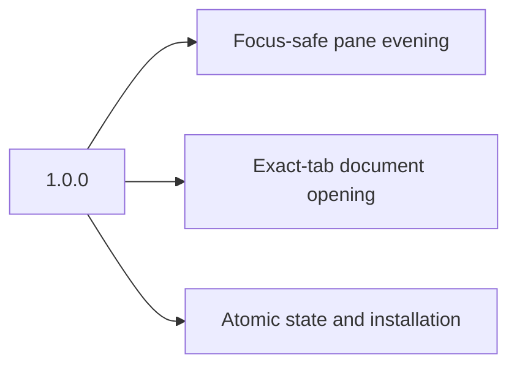

# Changelog

All notable changes are documented here. The format follows [Keep a Changelog](https://keepachangelog.com/en/1.1.0/), and versions follow [Semantic Versioning](https://semver.org/).

## [Unreleased]

### Added

- `PANE_ANCHOR` names a target tab deliberately, for callers behind a multiplexer or a remote shell whose terminal is not the tab's own.
- A browser-independent renderer converts flow, sequence, state, class, entity-relationship, and XY diagrams directly to inline SVG.
- `pane --doctor` now proves all three required documentation diagram forms with real Mermaid-to-SVG conversions.

### Fixed

- The watcher no longer exits when a tab changes under one sweep. Opening a
  document is itself what changes the pane tree, so `WRONG_TREE` and a timed-out
  layout call both landed exactly where evening was needed, and launchd's
  30-second restart delay left the tab uneven until well after the pane
  appeared. Both are now reported and retried on the next event. A lost
  connection still ends the process, because that does need a restart.
- A crowded tab gives up its oldest document pane instead of losing the
  document. Tabs were reaching fourteen panes at 246pt before iTerm2 refused to
  split, and the failure named nothing that could be done about it.
- A document is no longer thrown away because the person changed tabs while it
  opened. The pane is in the tab that asked for it and is not selected, so it
  costs them nothing. Focus landing on the document itself is still rolled back,
  because that is the tool pulling someone to a page they did not ask to read.
- `pane --doctor` no longer reports the WebKit process count as a failure when
  the process table cannot be read. An unanswerable probe already passed for
  caller placement; reporting the other as broken taught agents inside a sandbox
  to give up on a healthy tool.

- Side-pane Markdown no longer depends on a temporary Chromium process that can crash or hang before the pane opens.
- iTerm browser creation now has a 30-second deadline. Under WebKit process pressure it was measured at 16.25 seconds, so the former 10-second helper deadline killed a healthy operation after the pane was created and left it untracked.
- A document helper terminated at that deadline now uses a private creation receipt, with pre-split session recovery for the interval before publication, so the caller closes the exact pane instead of orphaning it.
- The doctor now reports the 400-process WebKit limit that makes macOS reject new iTerm browser processes.
- A process detached from its tab can no longer open, close, or even it. `ITERM_SESSION_ID` is inherited by every child, so a background job kept a valid address for the tab that started it and split that tab long after leaving it. The caller's terminal, taken from the nearest ancestor that has one, must now be the terminal iTerm2 reports for that tab, and the check runs before rendering. Where the process table cannot be read the caller is unplaceable rather than detached, and the check is skipped; `pane --doctor` says so.

- Mermaid diagrams are no longer dropped. The placeholder was a raw HTML node, which `remark-rehype` discards along with all other raw HTML, so every diagram was silently lost after being rendered.
- YAML frontmatter is parsed as frontmatter instead of rendering as a thematic break followed by a setext heading.
- The document title is read from the parsed tree, so `#` lines inside code fences and frontmatter are no longer mistaken for the heading. Setext level-1 headings are now recognised.
- The document title now ignores empty and image-only headings and headings quoted inside blockquotes or list items, and falls back to a file name whose extension is stripped case-insensitively.
- Frontmatter is recognised after a stray leading blank line, and TOML frontmatter is dropped alongside YAML.

## [1.0.0] - 2026-08-31

### Added

- Event-driven automatic evening for the selected active iTerm2 tab.
- Focus-safe document opening in the exact calling tab, including background tabs.
- Atomic state writes and process-owned command locking.
- Self-contained Markdown rendering with pre-rendered Mermaid diagrams.
- Versioned installation, health checks, update rollback, and uninstall support.
- Python and Node regression suites, dependency audit, and continuous integration.
