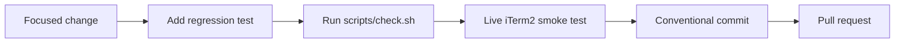

# Contributing



Contributions should preserve the narrow product contract: equal selected-tab panes and exact-tab document opening without global focus changes.

## Development setup

```text
npm ci --ignore-scripts
python3 -m venv venv
venv/bin/python3 -m pip install -r requirements.lock -r requirements-dev.lock
./scripts/check.sh
```

Set `PYTHON=venv/bin/python3` when another Python is the default.

## Standards

- Add a regression test for every bug fix.
- Keep document delivery and automatic evening independent.
- Do not add polling that mutates hidden tabs.
- Do not catch and discard state, focus, or iTerm2 API errors.
- Keep dependencies pinned and `npm audit --omit=dev` clean.
- Use conventional commits such as `fix: preserve focus during hidden-tab open`.
- Update architecture or troubleshooting documentation when behavior changes.

## Live verification

Automated tests mock iTerm2. Before merging a focus-sensitive change, verify:

1. Open and replace a document in the selected tab.
2. Open a document from a background tab while typing elsewhere.
3. Create and close panes, resize the window, and switch tabs.
4. Zoom a pane and confirm the watcher leaves it alone.
5. Restart iTerm2 and run `pane --doctor`.
