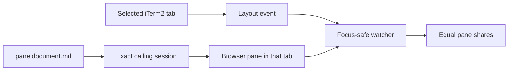

# iTerm Pane Manager



[](https://github.com/anik8das/iterm-pane-manager/actions/workflows/ci.yml)
[](LICENSE)

Keep iTerm2 split panes equal without changing normal focus behavior. The optional `pane` command also opens Markdown, HTML, or web documents beside the exact terminal session that requested them—even when that tab is in the background.

## Guarantees

- The watcher only resizes the selected tab while iTerm2 is active.
- Hidden tabs, other windows, zoomed panes, and tmux layouts are not mutated.
- The watcher never opens, closes, moves, or reloads a document.
- A document opens in its calling session's tab without selecting that tab.
- Only a process actually in that tab may open, close, or even it; `PANE_ANCHOR` overrides.
- User tab and window changes always win if they race with a document open.
- Reopening the same document replaces its tracked browser pane.

## Requirements

- macOS with iTerm2
- Node.js 20.19 or newer
- Python 3.9 or newer
- iTerm2 **Settings → General → Magic → Enable Python API**

## Install

```text
git clone https://github.com/anik8das/iterm-pane-manager.git
cd iterm-pane-manager
./scripts/install.sh
```

The installer stages and tests a versioned release before switching the live installation. It installs commands in `/usr/local/bin` when that directory is writable, otherwise in `~/.local/bin`.

## Use

```text
# Open a document beside this terminal pane
pane notes/design.md

# Open Markdown as plain text
pane notes/design.md --raw

# Show or close tracked document panes
pane --list
pane --close notes/design.md
pane --close-all

# Even this tab now, or every tab now
pane --even
pane --even --all

# Inspect or temporarily pause automatic evening
pane --watch-status
pane --pause
pane --resume
pane --doctor
```

Automatic evening starts during installation and after login. A 250 ms event debounce prevents resize storms; a five-second read-only poll catches missed iTerm2 events.
Opening and closing commands do not resize panes themselves; the focus-safe watcher handles the resulting layout event.

## Update and uninstall

Pull the repository and run `./scripts/install.sh` again. If staging, tests, watcher startup, or the health check fails, the installer restores the previous release.

```text
git pull --ff-only
./scripts/install.sh

# Remove the runtime and watcher; documents and local state remain
./scripts/uninstall.sh
```

## Documentation

- [Architecture](docs/architecture.md)
- [Troubleshooting](docs/troubleshooting.md)
- [Contributing](CONTRIBUTING.md)
- [Security policy](SECURITY.md)

## Author

Created and maintained by [Aniket Das](https://github.com/anik8das). Released under the [MIT License](LICENSE).
