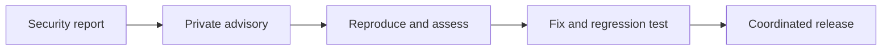

# Security Policy

Please report vulnerabilities through [GitHub private vulnerability reporting](https://github.com/anik8das/iterm-pane-manager/security/advisories/new). Do not open a public issue for an undisclosed vulnerability.

The project supports the latest release on `main`. Security fixes include a regression test when practical. Dependency advisories block releases.

The tool controls iTerm2 sessions and renders local Markdown. Diagram labels are escaped before their SVG is placed in the page, and generated pages load no remote diagram assets. Install only from this repository, review changes before updating, and do not run documents from untrusted sources.
