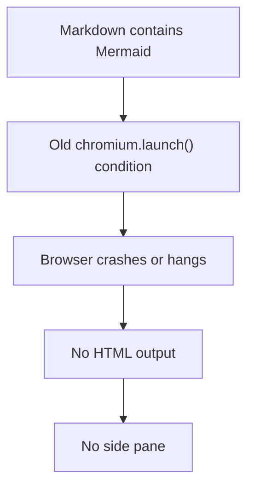
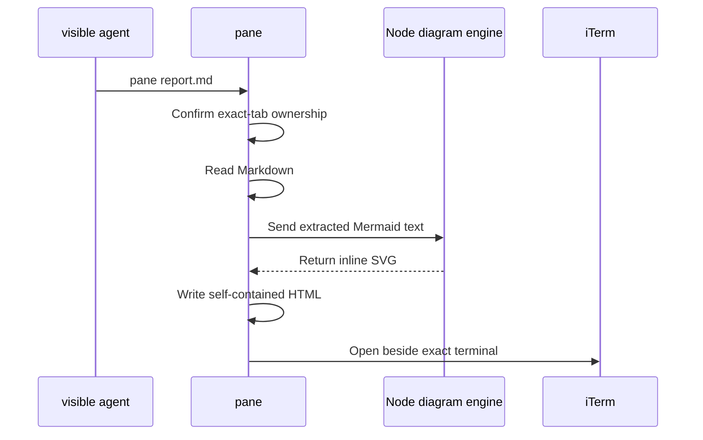
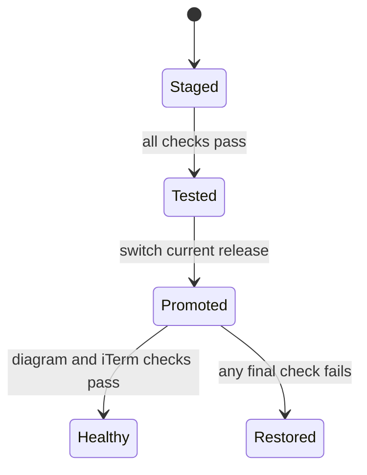

# Side-pane document incident

Two failures were stacked. The document command made every Mermaid diagram depend on a temporary browser, and macOS has exactly 400 WebKit content processes alive. The first stopped Markdown rendering; the second makes iTerm retire one browser process before starting another.

## Proven root cause

- At commit `ed639e8`, `bin/mdrender.mjs:51` called `chromium.launch()` directly from the document command. That exact condition produced the reported failure.
- Failed launches ended with `SIGSEGV` at `IONotificationPortGetRunLoopSource`; one sandboxed agent also produced `bootstrap_check_in ... Permission denied (1100)` in the macOS log.
- Two bundled Chromium revisions failed. Installed Chrome also hung, WebKit hung, and a per-user LaunchAgent running the original Chromium call crashed at the same point.
- The same Markdown converted to complete inline SVG immediately after the browser call was removed. The iTerm delivery code was unchanged.
- Exact-tab delivery is healthy: a rendered document opens beside the requested foreground terminal without changing focus.
- The old health check tested only whether `bin/mdrender.mjs` existed. It could report success without exercising any diagram.
- macOS logged `ExceededProcessCountLimit` when iTerm tried to open the rendered page. A **WebKit content process** is the helper that displays one or more web pages for macOS apps; 400 are currently alive, many for several days.
- Under that pressure, the exact iTerm replacement call completed successfully in 16.25 seconds. `src/node/runtime.mjs` gave every helper only 10 seconds, killed the document helper after its pane was created, and left that pane untracked.

The exact operating-system defect behind the stale process count is outside this project. The two project defects are making a static SVG depend on browser startup and killing a valid iTerm operation before its measured completion time.

## Scope

Background workers launched by Otto are intentionally out of scope. They have no visible terminal, and the existing ownership check must continue to refuse them rather than guess which tab should receive a pane.

The feature is for coding agents running inside visible iTerm tabs. They keep the existing requirements: a valid iTerm session address and ownership of that terminal.

## Implemented repair

- Replaced the Playwright, Chromium, and Mermaid browser packages with a browser-independent SVG renderer.
- Flowcharts, call-sequence diagrams, state diagrams, class diagrams, entity-relationship diagrams, and XY charts render directly in Node.
- Removed the renderer's optional remote-font import so generated pages make no font request and remain self-contained.
- Kept HTML labels escaped; a regression test proves diagram text cannot inject a script element.
- A malformed diagram becomes a visible error inside the document instead of discarding the whole page.
- `pane --doctor` now renders flow, sequence, and state diagrams and requires inline SVG from all three.
- Document creation has a separate 30-second deadline, while fast read-only helpers keep the existing 10-second bound.
- A private creation receipt records the new pane immediately. If termination lands before that receipt, the caller compares the target tab with its pre-split session list and recovers only the new pane carrying this document's unique profile name. Either path closes the exact pane instead of leaving it untracked.
- The doctor now fails clearly when the WebKit count reaches the proven 400-process limit.
- Removed the temporary sandbox exception because the command no longer launches a browser.

## Failure behavior

| Failure | Result |
| --- | --- |
| Unsupported diagram kind | That diagram shows a visible error; the rest of the document renders. |
| Malformed diagram | That diagram shows the renderer's first error line. |
| WebKit reaches 400 content processes | The doctor names the process count and reports that macOS is rejecting new browser processes. |
| Document helper is terminated after a split | The caller uses the receipt, or the pre-split session list plus unique profile name, to close the exact new pane. |
| Caller has no visible terminal | The ownership guard refuses it before rendering. |
| User changes tabs during the split | The created pane is rolled back and focus is left alone. |
| Invalid state file | The file is preserved and the command fails loudly. |

## Installation and rollback

- Installation no longer downloads a browser.
- Dependencies and tests are staged before the live release changes.
- The final doctor check proves all required diagram forms, iTerm connection, and available browser capacity.
- A failed final check restores the previous release and watcher.

## Validation target

- Run all Node, Python, lint, shell, dependency, and blocked-content checks.
- Render every Markdown document in this repository with no diagram errors.
- Clear the current WebKit process exhaustion, install the final versioned release, and require every `pane --doctor` check to pass.
- Open this report repeatedly from the visible agent command and confirm it replaces the tracked pane in the exact tab without changing focus.
