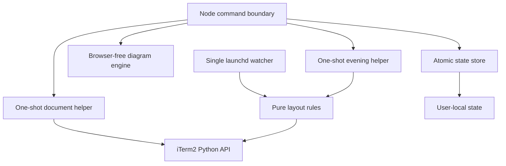
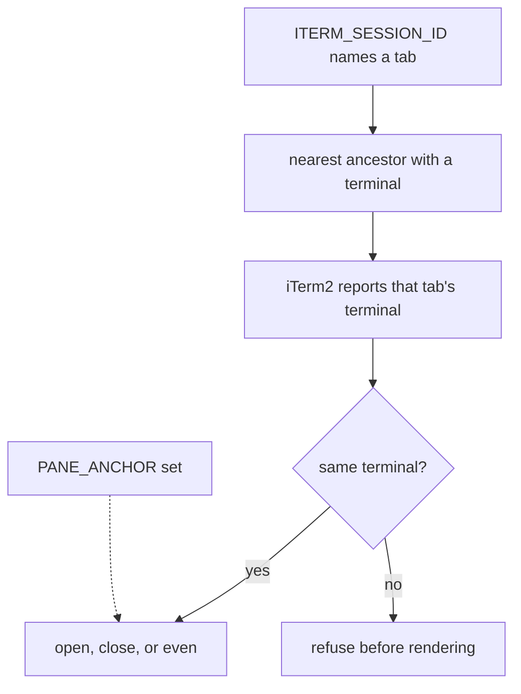
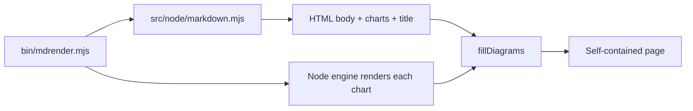
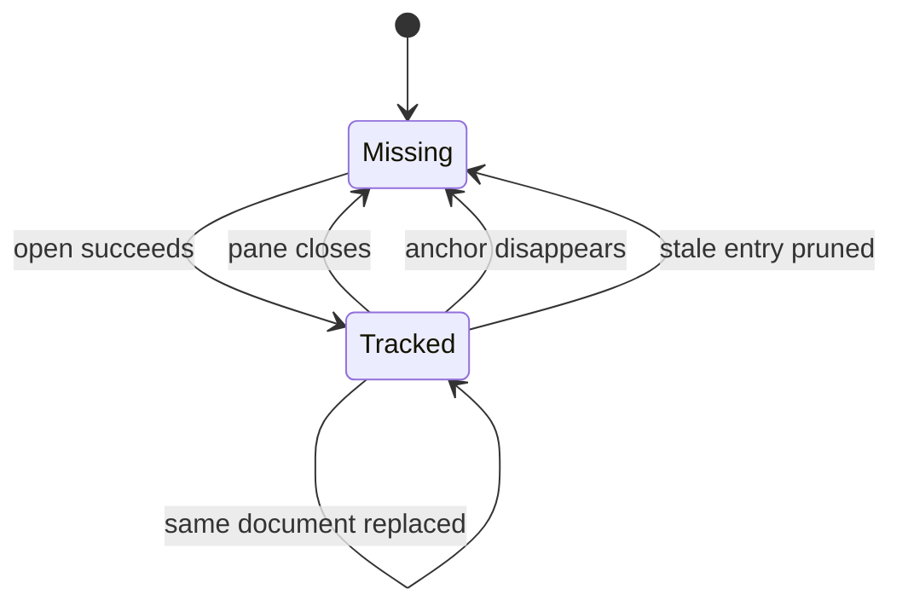
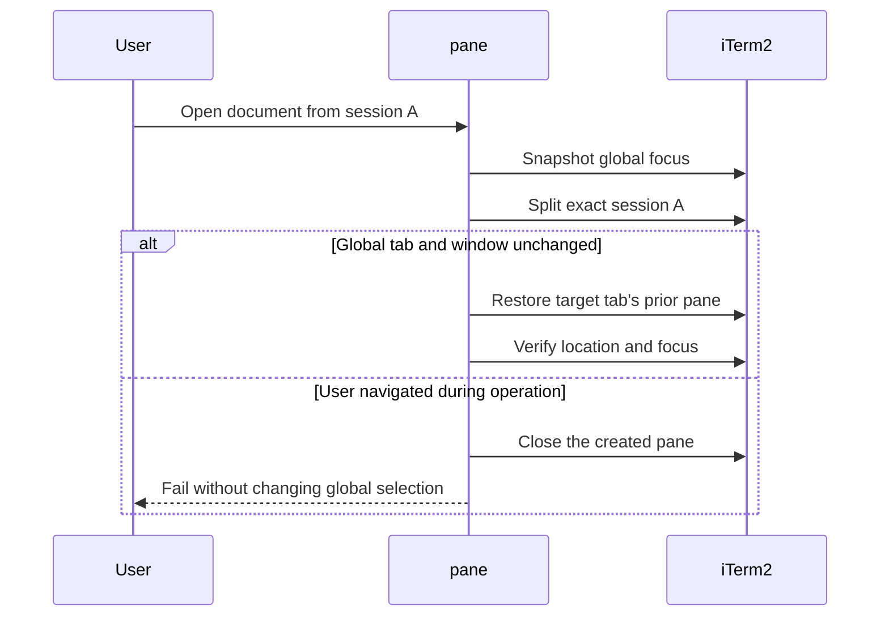

# Architecture

The design separates document delivery from automatic evening. The watcher has no document code and cannot create, close, move, or reload a pane.

## Boundaries

### Command boundary

`bin/pane.mjs` validates input, resolves files and URLs, serializes state changes, and invokes small Python helpers. It refuses to open a document without `ITERM_SESSION_ID`, because there is no safe target tab without the calling session's stable ID.

### Ownership contract

Naming a tab is not being in it. The variable is inherited by every child, so a detached job keeps a valid address for a tab it left, and would otherwise split, close, or resize a tab nobody there asked it to touch. The caller's terminal is taken from the nearest ancestor that has one, because an agent runs its commands without a controlling terminal of their own; a detached caller reaches the init process without finding one and is refused. Both sides must be known, and the check runs before Markdown is rendered so a refusal leaves nothing behind. `PANE_ANCHOR` names a tab deliberately and skips the check, which is the way out for a multiplexer or a remote shell, where the terminal is genuinely not the tab's own.

A sandbox that denies process information makes the caller unplaceable rather than detached. Refusing then would turn the guard on every caller inside one, including the agents that use this tool most, so an unanswerable question is not treated as a failed answer and the check is skipped. `pane --doctor` reports which of the two applies.

### Rendering boundary

`src/node/markdown.mjs` owns Markdown to HTML and needs no browser. It emits one placeholder per Mermaid block and `fillDiagrams` substitutes the SVG produced by `src/node/diagram.mjs`. Flow, sequence, state, class, entity-relationship, and XY diagrams render directly in Node, so a document command never starts a browser process.

The renderer escapes diagram labels and strips its optional remote-font import. Each finished page therefore contains its diagrams inline and needs no network request to display them.

Raw HTML in a source document is discarded. The diagram placeholder therefore carries an explicit `hName`/`hProperties` shape rather than being a raw HTML node, which keeps untrusted markup out of the page without losing the placeholder. YAML and TOML frontmatter are parsed so they are dropped rather than rendered. As in every frontmatter-aware renderer, an opening `---` is a fence rather than a thematic break, so a document that starts with a rule loses its first block; a rule anywhere else is untouched. The title comes from the first non-empty level-1 heading at the top level of the tree, ignoring headings quoted inside blockquotes or list items, and falls back to the file name.

### iTerm2 boundary

Python is used only where the iTerm2 API is required:

- `document.py` creates one browser split against an exact anchor session.
- `even.py` performs only an explicitly requested one-shot resize.
- `watch.py` listens for layout/focus events and measures the selected tab.
- `sessions.py` queries and closes sessions by stable ID.
- `layout.py` owns shared measurement and equal-sizing rules.

### State boundary

State lives at `~/.local/state/iterm-pane/state.json`. It records only document identity, anchor session, browser session, and a neutral profile name. Writes use a same-directory temporary file, file sync, and atomic rename. A process-owned directory lock prevents concurrent read-modify-write loss.

## Focus contract

The opener validates both placement and global focus. It never activates a window or tab during normal operation. If the user navigates while a split is in flight, that navigation is treated as authoritative.

The watcher stores the selected session before resizing. If iTerm2 selects a sibling as a side effect of applying layout, it restores the original session with both `select_tab` and `order_window_front` disabled. If the user changes tabs, the watcher does nothing further.

Document open and close commands never call the one-shot resizer. Their layout event is handled by the watcher, which owns the selection-preservation logic.

## Evening policy

A tab is resized only when all of these conditions are true:

- iTerm2 is the active application.
- The tab is selected in the current window.
- The tab has at least two visible panes.
- The tab is not controlled by tmux.
- No pane is zoomed.
- Pane spread, dead space, or pane-count change indicates a layout update is needed.

Terminal grids round to whole character cells, so a 12-point tolerance prevents harmless rounding from causing a resize loop. A burst guard backs off for 60 seconds if another program repeatedly fights the layout.

## Process lifecycle

The installer creates one per-user LaunchAgent named `io.github.anik8das.iterm-pane-manager`. **LaunchAgent** means a macOS background process owned by the signed-in user. macOS owns restart policy; the watcher owns one iTerm2 connection lifecycle and exits on disconnect. There is no internal reconnect loop.

Versioned releases are stored below `~/.local/share/iterm-pane-manager/releases`. The `current` symlink is changed only after dependencies and tests pass. Watcher startup and `pane --doctor` are the final promotion gates.

## Failure modes

| Failure | Behavior |
|---|---|
| iTerm2 API disabled | Command fails with the exact setting to enable; state is not advanced. |
| State JSON invalid | Command fails loudly and preserves the file for recovery. |
| Concurrent commands | The second command waits for the owned state lock, then reads fresh state. |
| Caller detached from its tab | The command fails before rendering; `PANE_ANCHOR` overrides. |
| Anchor tab already closed | The command fails naming the session, before rendering. |
| Wrong-tab split | The new browser closes and the command fails. |
| User navigates during split | The new browser closes; user focus is not restored or redirected. |
| WebKit is retiring a content process | Document opening has a separate 30-second deadline instead of the 10-second helper deadline. |
| WebKit reaches its 400-process limit | The doctor fails with the measured count before a false all-clear. |
| Layout cannot settle | The watcher records the unchanged signature and stops retrying until shape changes. |
| Repeated external resizing | The burst guard pauses mutation for 60 seconds. |
| Unsupported diagram | That diagram becomes a visible error; the rest of the page renders. |
| Failed update | The installer restores the previous runtime symlink and watcher. |
