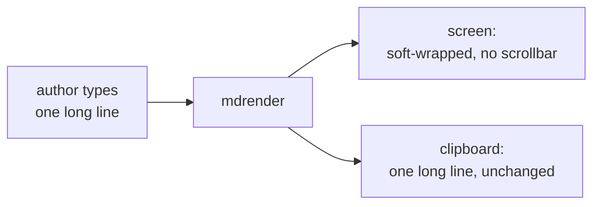
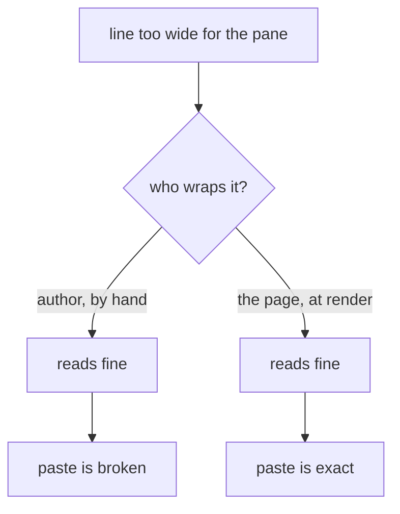

# Code blocks wrap; only real newlines get copied

Long lines in a fenced block now fold onto the next line instead of running off the right edge.
The fold is a soft wrap, meaning the browser draws it but no character is added, so the copy
button still hands you exactly the text the author typed.



That splits the two jobs that used to fight each other. Before, a block either scrolled sideways
(unreadable) or the author broke the line by hand to make it fit, and that hand break was a real
newline that landed in every paste.



## What changed

| where | change |
|---|---|
| `bin/mdrender.mjs:62` | `pre` gets `white-space:pre-wrap` and `overflow-wrap:anywhere`, replacing `overflow-x:auto` |
| `bin/mdrender.mjs:75` | the `pre` inside a `.codeblock` gets right padding so a wrapped line does not run under the Copy button |
| `tests/node/renderer.test.mjs` | a long line renders wrapped and reaches `</code>` with only the newlines the author typed |
| `~/.claude/CLAUDE.md` | house rule: never hard-wrap inside a fence |

`overflow-wrap:anywhere` is the part that handles a single unbreakable token, a 300-character URL
or a hash, which has no space to fold at. It breaks mid-token on screen only.

## Try the copy button on this

One line. Paste it and it should arrive as one line.

```text
curl -X POST https://api.example.test/v1/documents/render --header "Authorization: Bearer $TOKEN" --header "Content-Type: application/json" --data '{"source":"report.md","theme":"light","diagrams":true,"wrap":"soft","notes":"this line is deliberately far wider than the pane so you can check that the wrap you see on screen is not in what you paste"}'
```

Two lines, because the text genuinely has two.

```text
cd ~/coding/iterm-pane-manager
./scripts/install.sh
```

## Installed

Cut as a new release and switched live, so every pane rendered from now on wraps. Health check
passed on all ten probes. Docs already rendered to `.html` before today keep the old stylesheet
until they are re-rendered.
