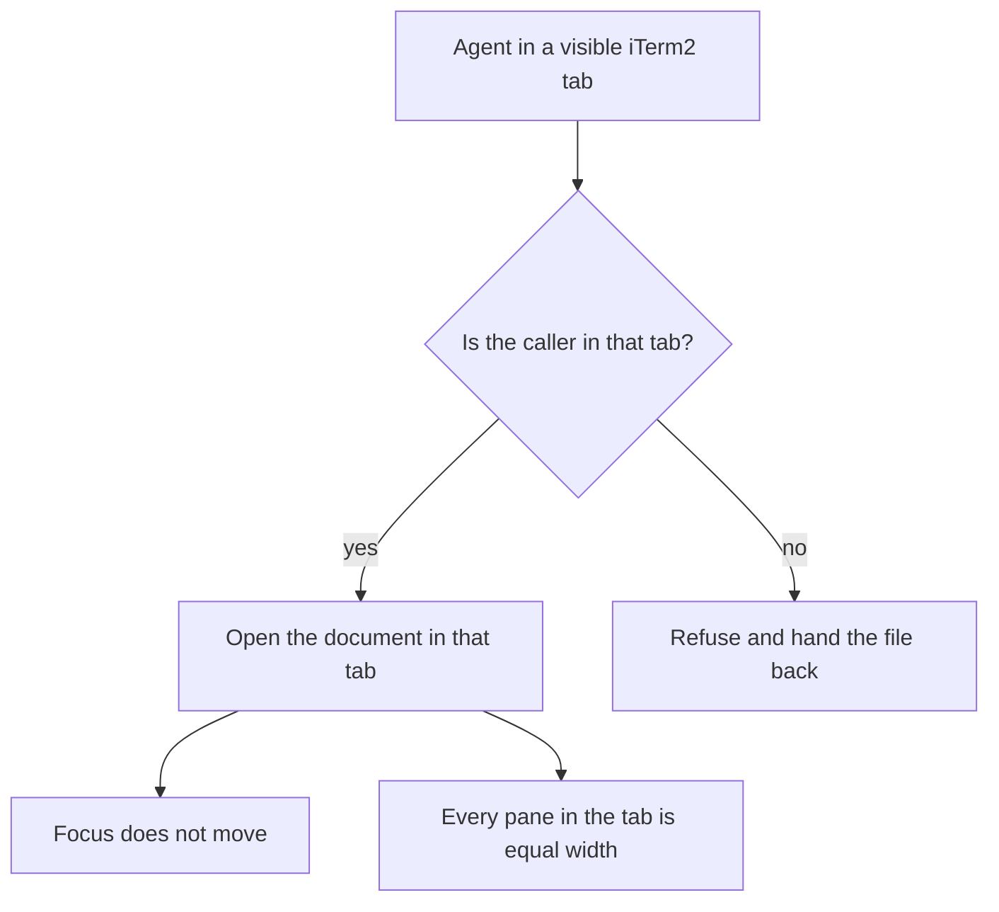

# Goals

What this tool is for, stated as rules it must keep. Anything that breaks a rule
here is a defect, even if every test passes.

## Who this is for

The user runs several coding agents at once, each in its own iTerm2 tab, and
reads what they write in a browser pane beside the terminal. That reading pane
is the product. Everything else exists to put it in the right place without
disturbing the tab the user is actually looking at.

## The rules

### 1. Any visible agent may open a document at any time

An agent running in an iTerm2 tab can open a document beside itself whenever it
wants. It does not have to wait for its tab to be in front, and it does not have
to ask the user for permission or for a tab name.

### 2. A document opens in the calling agent's own tab

Never in another tab, never in a new window. An agent in a background tab gets
its pane in that background tab. Guessing is worse than failing: a pane in the
wrong tab lands in a colleague's workspace.

### 3. Opening a document never moves the user's focus

Not the selected tab, not the selected pane, not the front window, not the
cursor. If the user is typing in tab 3, a document opening in tab 7 must be
invisible to them until they switch to tab 7 themselves.

If the tool cannot open the pane without moving focus, it must not open it.
Focus outranks delivery.

### 4. Background agents are refused, and they must fail quietly

An agent with no visible terminal, an Otto worker for example, has no tab of its
own. It must be refused rather than allowed to pick a tab.

The refusal is correct behavior, not an error to work around. A refused agent
should hand the file path back to whoever asked, in one line. It must not:

- guess a tab or set `PANE_ANCHOR` to one it did not earn
- tell the user the tool is broken
- ask the user to open the file by hand

Wording that works: "Written to `<path>`. I am a background job with no tab, so
run `pane <path>` yourself or ask a foreground agent to."

### 5. Every pane in the selected tab is equal width

Including in the moment a new document pane appears. A new pane is the most
common reason a tab goes uneven, so evening has to survive the split that caused
it, not die on it.

Only the selected tab of the active window is resized. Hidden tabs, other
windows, zoomed panes, and tmux tabs are left alone.

### 5a. A tab holds at most three document panes

Equal widths and one pane per document pull the same way: each document makes
every pane narrower, and the next document splits a narrower pane again. Left
alone this ends with iTerm2 refusing to split at all and the document lost.

A tab at its limit gives up its oldest document pane to make room. Terminals
are never closed, and neither is the pane being read at that moment.

### 6. A failure leaves the tab exactly as it was

No orphan panes, no half-open browsers, no resized tabs the user did not ask
for. If an open cannot finish, the pane it created is closed.

### 7. An unanswerable question is not a failure

Agents run inside sandboxes that block the process table. A probe that cannot
run has not proved anything is wrong, so it must not be reported as broken.
`pane --doctor` says "unavailable" for those, and the tool proceeds. Reporting
them as failures teaches agents to give up on a healthy tool.

## Out of scope

- Agents outside iTerm2. If it is not an iTerm2 tab, there is nothing to split.
- Making background agents work. Rule 4 refuses them on purpose.
- Multiplexers and remote shells, except through an explicit `PANE_ANCHOR` the
  caller sets deliberately.
