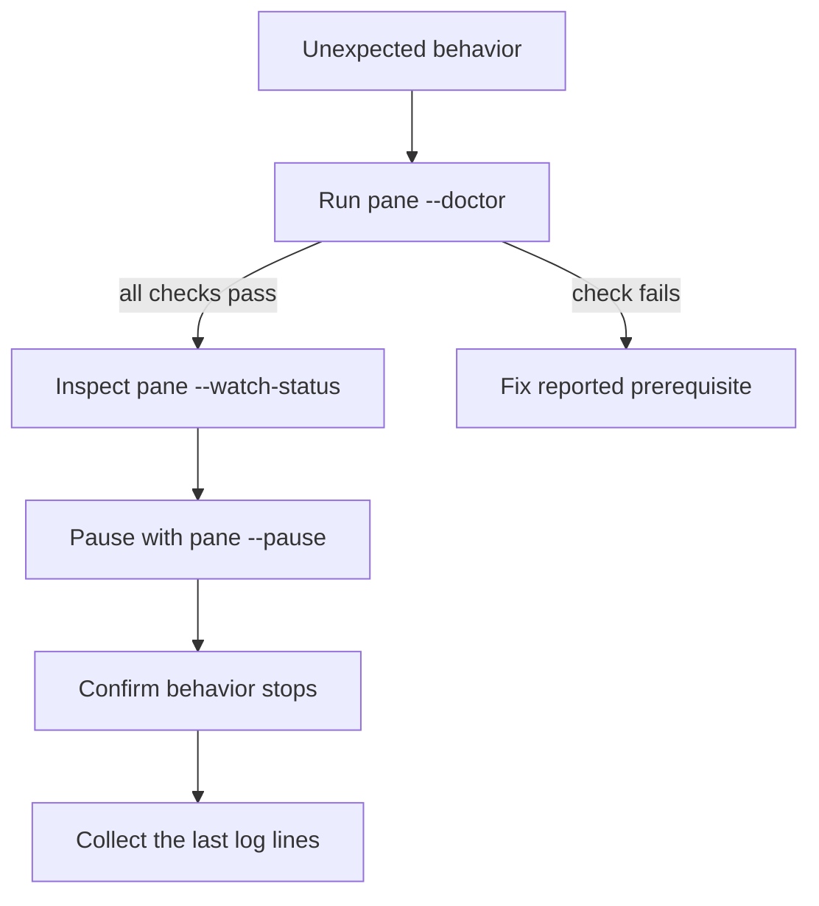

# Troubleshooting



Start with:

```text
pane --doctor
pane --watch-status
```

## Panes are not evening

- Confirm iTerm2's Python API is enabled under **Settings → General → Magic**.
- Run `pane --resume` in case the watcher is paused.
- Zoomed panes and tmux tabs are skipped intentionally.
- Run `pane --even` to test the one-shot path separately from the watcher.

## Focus changes unexpectedly

Pause automatic evening immediately:

```text
pane --pause
```

If the behavior continues while paused, the watcher is not causing it. If it stops, capture `pane --watch-status` and open a bug report with the iTerm2 version, macOS version, pane layout, and exact reproduction steps.

The watcher log is stored at `~/.local/state/iterm-pane/watch.log`. It records layout decisions, not terminal contents.

## A document did not open

- Run the command inside the iTerm2 terminal pane whose tab should receive the document.
- Confirm the file exists and `ITERM_SESSION_ID` is present: `test -n "$ITERM_SESSION_ID"`.
- Run `pane --list` to inspect tracking state.
- A tracked pane can still be closed by its old path after the source file is deleted.
- `pane --doctor` renders all three required diagram forms, so its Mermaid line tests the real path.
- If iTerm repeatedly takes 30 seconds to create a browser pane, inspect the macOS log for `ExceededProcessCountLimit`; restarting browser-heavy apps or signing out clears stale WebKit content processes.
- The opener deliberately fails if focus or target location changes while the split is running; run it again after navigation stops.

### "this process is not in the tab named by ITERM_SESSION_ID"

The address is right and the caller is not there. `ITERM_SESSION_ID` is
inherited by every child, so a job that was detached from a tab keeps a valid
address for it, and a shell inside a multiplexer or a remote session carries an
address for a terminal it is not on.

Where that is deliberate, name the tab and say so:

```sh
PANE_ANCHOR="$ITERM_SESSION_ID" pane report.md
```

Where it is not, the document belongs to a background job that has no tab.
Render it without opening anything instead:

```sh
mdrender report.md --no-open
```

## State file recovery

Invalid JSON is never overwritten automatically. Preserve the broken file first:

```text
cp ~/.local/state/iterm-pane/state.json ~/.local/state/iterm-pane/state.json.backup
```

Then inspect and repair it. Deleting state does not close browser panes, but it makes existing document panes untracked, so deletion should be a last resort.

## Watcher recovery

```text
pane --watch-uninstall
pane --watch-install
pane --doctor
```

Re-running `scripts/install.sh` builds a fresh versioned runtime and rolls back automatically if verification fails.
